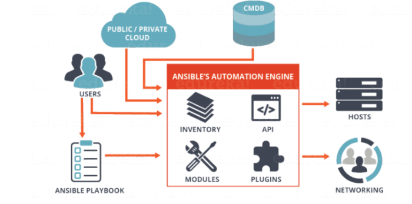

# 101 - Ansible Crash-Course Workshop

- [101 - Ansible Crash-Course Workshop](#101---ansible-crash-course-workshop)
  * [Introduction](#introduction)
    * [Principles](#principles)
    * [What's Ansible](#whats-ansible)
    * [Localhost sweet localhost](#localhost-sweet-localhost)
    * [The key to success](#the-key-to-success)
    * [Inventories](#inventories)
    * [Ansible Configuration](#ansible-configuration)
  * [Let's automate the world](#lets-automate-the-world)
    * [Write with style](#write-with-sytle)
    * [Let it be my first](#let-it-be-my-first)
    * [Will it be my first](#will-it-be-my-first)
    * [Handling Handling](#handling-handling)
    * [Can you keep a secret?](#can-you-keep-a-secret)
    * [Welcome the new user](#welcome-the-new-user)
    * [Path to the role](#path-to-the-role)
    * [Role?](#role)
    * [A window to the world](#a-window-to-the-world)
    * [Conditions](#conditions)
    * [If](#if)

## Introduction
The 101 is a run through Ansible components providing the necessary hands-on to build automation with a good set of principles and best practices.

### Principles 
Some principles to keep in mind during this workshop and as takeaways:
* automation should be considered as coding and as such the content should be hosted on version-control system like Git. 
* better have a KISS than a sorry... Keep It Stupid Simple; start with basic playbook and static inventory then fluff© it up
* plan-create-test-(feedback-)deliver loop (think DevOps) then refactor and modularize later
* use modules as much as possible!
* resort to using shell or command only when a module is not available

### what's Ansible?


Idempotent
```
Being idempotent allows the defined task to run one time or a thousand times without having an adverse effect on the target system, only ever making the change once. 
In other words, if a change is required to get the system into its desired state, the change is made; and if the device is already in its desired state, no change is made. 
This is unlike most traditional custom scripts and the copy and pasting of CLI commands into a terminal window. When the same command or script is executed repeatedly on the same system, errors are (sometimes) raised.
```
— Jason Edelman
Network Automation with Ansible

### Localhost sweet localhost
Let's install Ansible on your machine or access a machine with Ansible. Then try the following:
```
ansible localhost -m ping
```
The expected outcome is:
```
localhost | SUCCESS => {
    "changed": false, 
    "ping": "pong"
}
```
Then try the following:
```
ansible localhost -m setup
``` 
Let's discuss about it for 2 minutes, then forgot about it for a couple of hours and come back to it.

### The key to success
Ansible is agentless and doesn't work in a pull approach but in push with credentials.

#### Linux
When it comes to Linux, the connection towards the target is done through SSH.
This is a very basic process, unless SSH has been disabled, only a valid user with SUDO rights is necessary along with a password-less connection. 

To do so, have a bit of play with: 
```
ssh-keygen
ssh-copy-id user@host
ssh user@host
```

#### Win
When it comes to Windows, the connection towards the target is done through WinRM.
Since Windows Vista, WinRM is shipped standard with Windows but needs to be enabled. 
Here is two references to make it happen painless:
* The following powershell script can be used to enable it:
https://github.com/ansible/ansible/tree/devel/examples/scripts 
* A good blog post about to connect to a Windows host:
https://www.ansible.com/blog/connecting-to-a-windows-host 

### Inventories
Ansible inventories are much more than just a list of target to run automation on and as such it deserves some real attention with some best practices.

Here is a bad example:

```
[mydb]
10.1.2.3
10.1.2.4

[myweb]
myhost01.mydomain.com
myhost02.mydomain.com
```
The above is indeed just a list with no real interest or power features.
What about this one:

```
[mydb]
db1     ansible_host=10.1.2.3
db2     ansible_host=10.1.2.4

[myweb]
web1    ansible_host=myhost01.mydomain.com
web2    ansible_host=myhost02.mydomain.com
```
Then, the concept of groups can be used to make easier automation
```
[mydb]
db1     ansible_host=10.1.2.3
db2     ansible_host=10.1.2.4

[myweb]
web1    ansible_host=myhost01.mydomain.com
web2    ansible_host=myhost02.mydomain.com

[dev]
db1
web1

[uat]
db2
web2
``` 
This inventory will allow to deploy a common set of packages and configurations towards 'mydb' and 'myweb' then deploy the application set towards a the group 'dev' and/or 'uat' with key differentiator like dataset, testings, ... 

The last addition to the inventory is about variables liked to it like:
```
[dev:vars]
var1=valuexyz
var2=valueyxz
```
When working with a large or/and complex inventory, the following CLI commands are useful:
```
$ ansible-inventory -i 101/examples/ --list
{
    "_meta": {
        "hostvars": {
            "db1": {
                "ansible_host": "10.1.2.3"
            }, 
            "db2": {
                "ansible_host": "10.1.2.4"
            }, 
            "web1": {
                "ansible_host": "myhost01.mydomain.com"
            }, 
            "web2": {
                "ansible_host": "myhost02.mydomain.com"
            }
        }
    }, 
    "all": {
        "children": [
            "dev", 
            "mydb", 
            "myweb", 
            "uat", 
            "ungrouped"
        ]
    }, 
    "dev": {
        "hosts": [
            "db1", 
            "var1=valuexyz", 
            "var2=valueyxz", 
            "web1"
        ]
    }, 
    "mydb": {
        "hosts": [
            "db1", 
            "db2"
        ]
    }, 
    "myweb": {
        "hosts": [
            "web1", 
            "web2"
        ]
    }, 
    "uat": {
        "hosts": [
            "db2", 
            "web2"
        ]
    }
}

$ ansible-inventory -i 101/examples/  --graph
@all:
  |--@dev:
  |  |--db1
  |  |--var1=valuexyz
  |  |--var2=valueyxz
  |  |--web1
  |--@mydb:
  |  |--db1
  |  |--db2
  |--@myweb:
  |  |--web1
  |  |--web2
  |--@uat:
  |  |--db2
  |  |--web2
  |--@ungrouped:
```
Note how the variables have been merged with their respective group of hosts.

### Ansible Configuration
Let's rewind a bit! So far the topics of installation, connection, and inventory have been discussed. It's time to get a view on how to impact them on a global scale with the "ansible.cfg" config that can be present at the following locations:
* /etc/ansible/ansible.cfg      (global and first in line)
* ~/.ansible.cfg    (hidden file in user home directory)
* ./ansible.cfg     (current directory)

A custom version of the file can be as simple as:

```
[defaults]
inventory = ./inventory
remote_user = user
ask_pass = false

[privilege_escalation]
become = true
become_method = sudo
become_user = root
become_ask_pass = false
``` 
Note that these newly defined values can be overridden in playbook or with CLI options. Here is the content of the "/etc/ansible/ansible.cfg" for reference:
```
# config file for ansible -- https://ansible.com/
# ===============================================

# nearly all parameters can be overridden in ansible-playbook
# or with command line flags. ansible will read ANSIBLE_CONFIG,
# ansible.cfg in the current working directory, .ansible.cfg in
# the home directory or /etc/ansible/ansible.cfg, whichever it
# finds first

[defaults]

# some basic default values...

#inventory      = /etc/ansible/hosts
#library        = /usr/share/my_modules/
#module_utils   = /usr/share/my_module_utils/
#remote_tmp     = ~/.ansible/tmp
#local_tmp      = ~/.ansible/tmp
#plugin_filters_cfg = /etc/ansible/plugin_filters.yml
#forks          = 5
#poll_interval  = 15
#sudo_user      = root
#ask_sudo_pass = True
#ask_pass      = True
#transport      = smart
#remote_port    = 22
#module_lang    = C
#module_set_locale = False

# plays will gather facts by default, which contain information about
# the remote system.
#
# smart - gather by default, but don't regather if already gathered
# implicit - gather by default, turn off with gather_facts: False
# explicit - do not gather by default, must say gather_facts: True
#gathering = implicit

# This only affects the gathering done by a play's gather_facts directive,
# by default gathering retrieves all facts subsets
# all - gather all subsets
# network - gather min and network facts
# hardware - gather hardware facts (longest facts to retrieve)
# virtual - gather min and virtual facts
# facter - import facts from facter
# ohai - import facts from ohai
# You can combine them using comma (ex: network,virtual)
# You can negate them using ! (ex: !hardware,!facter,!ohai)
# A minimal set of facts is always gathered.
#gather_subset = all

# some hardware related facts are collected
# with a maximum timeout of 10 seconds. This
# option lets you increase or decrease that
# timeout to something more suitable for the
# environment.
# gather_timeout = 10

# Ansible facts are available inside the ansible_facts.* dictionary
# namespace. This setting maintains the behaviour which was the default prior
# to 2.5, duplicating these variables into the main namespace, each with a
# prefix of 'ansible_'.
# This variable is set to True by default for backwards compatibility. It
# will be changed to a default of 'False' in a future release.
# ansible_facts.
# inject_facts_as_vars = True

# additional paths to search for roles in, colon separated
#roles_path    = /etc/ansible/roles

# uncomment this to disable SSH key host checking
#host_key_checking = False

# change the default callback, you can only have one 'stdout' type  enabled at a time.
#stdout_callback = skippy


## Ansible ships with some plugins that require whitelisting,
## this is done to avoid running all of a type by default.
## These setting lists those that you want enabled for your system.
## Custom plugins should not need this unless plugin author specifies it.

# enable callback plugins, they can output to stdout but cannot be 'stdout' type.
#callback_whitelist = timer, mail

# Determine whether includes in tasks and handlers are "static" by
# default. As of 2.0, includes are dynamic by default. Setting these
# values to True will make includes behave more like they did in the
# 1.x versions.
#task_includes_static = False
#handler_includes_static = False

# Controls if a missing handler for a notification event is an error or a warning
#error_on_missing_handler = True

# change this for alternative sudo implementations
#sudo_exe = sudo

# What flags to pass to sudo
# WARNING: leaving out the defaults might create unexpected behaviours
#sudo_flags = -H -S -n

# SSH timeout
#timeout = 10

# default user to use for playbooks if user is not specified
# (/usr/bin/ansible will use current user as default)
#remote_user = root

# logging is off by default unless this path is defined
# if so defined, consider logrotate
#log_path = /var/log/ansible.log

# default module name for /usr/bin/ansible
#module_name = command

# use this shell for commands executed under sudo
# you may need to change this to bin/bash in rare instances
# if sudo is constrained
#executable = /bin/sh

# if inventory variables overlap, does the higher precedence one win
# or are hash values merged together?  The default is 'replace' but
# this can also be set to 'merge'.
#hash_behaviour = replace

# by default, variables from roles will be visible in the global variable
# scope. To prevent this, the following option can be enabled, and only
# tasks and handlers within the role will see the variables there
#private_role_vars = yes

# list any Jinja2 extensions to enable here:
#jinja2_extensions = jinja2.ext.do,jinja2.ext.i18n

# if set, always use this private key file for authentication, same as
# if passing --private-key to ansible or ansible-playbook
#private_key_file = /path/to/file

# If set, configures the path to the Vault password file as an alternative to
# specifying --vault-password-file on the command line.
#vault_password_file = /path/to/vault_password_file

# format of string {{ ansible_managed }} available within Jinja2
# templates indicates to users editing templates files will be replaced.
# replacing {file}, {host} and {uid} and strftime codes with proper values.
#ansible_managed = Ansible managed: {file} modified on %Y-%m-%d %H:%M:%S by {uid} on {host}
# {file}, {host}, {uid}, and the timestamp can all interfere with idempotence
# in some situations so the default is a static string:
#ansible_managed = Ansible managed

# by default, ansible-playbook will display "Skipping [host]" if it determines a task
# should not be run on a host.  Set this to "False" if you don't want to see these "Skipping"
# messages. NOTE: the task header will still be shown regardless of whether or not the
# task is skipped.
#display_skipped_hosts = True

# by default, if a task in a playbook does not include a name: field then
# ansible-playbook will construct a header that includes the task's action but
# not the task's args.  This is a security feature because ansible cannot know
# if the *module* considers an argument to be no_log at the time that the
# header is printed.  If your environment doesn't have a problem securing
# stdout from ansible-playbook (or you have manually specified no_log in your
# playbook on all of the tasks where you have secret information) then you can
# safely set this to True to get more informative messages.
#display_args_to_stdout = False

# by default (as of 1.3), Ansible will raise errors when attempting to dereference
# Jinja2 variables that are not set in templates or action lines. Uncomment this line
# to revert the behavior to pre-1.3.
#error_on_undefined_vars = False

# by default (as of 1.6), Ansible may display warnings based on the configuration of the
# system running ansible itself. This may include warnings about 3rd party packages or
# other conditions that should be resolved if possible.
# to disable these warnings, set the following value to False:
#system_warnings = True

# by default (as of 1.4), Ansible may display deprecation warnings for language
# features that should no longer be used and will be removed in future versions.
# to disable these warnings, set the following value to False:
#deprecation_warnings = True

# (as of 1.8), Ansible can optionally warn when usage of the shell and
# command module appear to be simplified by using a default Ansible module
# instead.  These warnings can be silenced by adjusting the following
# setting or adding warn=yes or warn=no to the end of the command line
# parameter string.  This will for example suggest using the git module
# instead of shelling out to the git command.
# command_warnings = False


# set plugin path directories here, separate with colons
#action_plugins     = /usr/share/ansible/plugins/action
#become_plugins     = /usr/share/ansible/plugins/become
#cache_plugins      = /usr/share/ansible/plugins/cache
#callback_plugins   = /usr/share/ansible/plugins/callback
#connection_plugins = /usr/share/ansible/plugins/connection
#lookup_plugins     = /usr/share/ansible/plugins/lookup
#inventory_plugins  = /usr/share/ansible/plugins/inventory
#vars_plugins       = /usr/share/ansible/plugins/vars
#filter_plugins     = /usr/share/ansible/plugins/filter
#test_plugins       = /usr/share/ansible/plugins/test
#terminal_plugins   = /usr/share/ansible/plugins/terminal
#strategy_plugins   = /usr/share/ansible/plugins/strategy


# by default, ansible will use the 'linear' strategy but you may want to try
# another one
#strategy = free

# by default callbacks are not loaded for /bin/ansible, enable this if you
# want, for example, a notification or logging callback to also apply to
# /bin/ansible runs
#bin_ansible_callbacks = False


# don't like cows?  that's unfortunate.
# set to 1 if you don't want cowsay support or export ANSIBLE_NOCOWS=1
#nocows = 1

# set which cowsay stencil you'd like to use by default. When set to 'random',
# a random stencil will be selected for each task. The selection will be filtered
# against the `cow_whitelist` option below.
#cow_selection = default
#cow_selection = random

# when using the 'random' option for cowsay, stencils will be restricted to this list.
# it should be formatted as a comma-separated list with no spaces between names.
# NOTE: line continuations here are for formatting purposes only, as the INI parser
#       in python does not support them.
#cow_whitelist=bud-frogs,bunny,cheese,daemon,default,dragon,elephant-in-snake,elephant,eyes,\
#              hellokitty,kitty,luke-koala,meow,milk,moofasa,moose,ren,sheep,small,stegosaurus,\
#              stimpy,supermilker,three-eyes,turkey,turtle,tux,udder,vader-koala,vader,www

# don't like colors either?
# set to 1 if you don't want colors, or export ANSIBLE_NOCOLOR=1
#nocolor = 1

# if set to a persistent type (not 'memory', for example 'redis') fact values
# from previous runs in Ansible will be stored.  This may be useful when
# wanting to use, for example, IP information from one group of servers
# without having to talk to them in the same playbook run to get their
# current IP information.
#fact_caching = memory

#This option tells Ansible where to cache facts. The value is plugin dependent.
#For the jsonfile plugin, it should be a path to a local directory.
#For the redis plugin, the value is a host:port:database triplet: fact_caching_connection = localhost:6379:0

#fact_caching_connection=/tmp


# retry files
# When a playbook fails a .retry file can be created that will be placed in ~/
# You can enable this feature by setting retry_files_enabled to True
# and you can change the location of the files by setting retry_files_save_path

#retry_files_enabled = False
#retry_files_save_path = ~/.ansible-retry

# squash actions
# Ansible can optimise actions that call modules with list parameters
# when looping. Instead of calling the module once per with_ item, the
# module is called once with all items at once. Currently this only works
# under limited circumstances, and only with parameters named 'name'.
#squash_actions = apk,apt,dnf,homebrew,pacman,pkgng,yum,zypper

# prevents logging of task data, off by default
#no_log = False

# prevents logging of tasks, but only on the targets, data is still logged on the master/controller
#no_target_syslog = False

# controls whether Ansible will raise an error or warning if a task has no
# choice but to create world readable temporary files to execute a module on
# the remote machine.  This option is False by default for security.  Users may
# turn this on to have behaviour more like Ansible prior to 2.1.x.  See
# https://docs.ansible.com/ansible/become.html#becoming-an-unprivileged-user
# for more secure ways to fix this than enabling this option.
#allow_world_readable_tmpfiles = False

# controls the compression level of variables sent to
# worker processes. At the default of 0, no compression
# is used. This value must be an integer from 0 to 9.
#var_compression_level = 9

# controls what compression method is used for new-style ansible modules when
# they are sent to the remote system.  The compression types depend on having
# support compiled into both the controller's python and the client's python.
# The names should match with the python Zipfile compression types:
# * ZIP_STORED (no compression. available everywhere)
# * ZIP_DEFLATED (uses zlib, the default)
# These values may be set per host via the ansible_module_compression inventory
# variable
#module_compression = 'ZIP_DEFLATED'

# This controls the cutoff point (in bytes) on --diff for files
# set to 0 for unlimited (RAM may suffer!).
#max_diff_size = 1048576

# This controls how ansible handles multiple --tags and --skip-tags arguments
# on the CLI.  If this is True then multiple arguments are merged together.  If
# it is False, then the last specified argument is used and the others are ignored.
# This option will be removed in 2.8.
#merge_multiple_cli_flags = True

# Controls showing custom stats at the end, off by default
#show_custom_stats = True

# Controls which files to ignore when using a directory as inventory with
# possibly multiple sources (both static and dynamic)
#inventory_ignore_extensions = ~, .orig, .bak, .ini, .cfg, .retry, .pyc, .pyo

# This family of modules use an alternative execution path optimized for network appliances
# only update this setting if you know how this works, otherwise it can break module execution
#network_group_modules=eos, nxos, ios, iosxr, junos, vyos

# When enabled, this option allows lookups (via variables like {{lookup('foo')}} or when used as
# a loop with `with_foo`) to return data that is not marked "unsafe". This means the data may contain
# jinja2 templating language which will be run through the templating engine.
# ENABLING THIS COULD BE A SECURITY RISK
#allow_unsafe_lookups = False

# set default errors for all plays
#any_errors_fatal = False

[inventory]
# enable inventory plugins, default: 'host_list', 'script', 'auto', 'yaml', 'ini', 'toml'
#enable_plugins = host_list, virtualbox, yaml, constructed

# ignore these extensions when parsing a directory as inventory source
#ignore_extensions = .pyc, .pyo, .swp, .bak, ~, .rpm, .md, .txt, ~, .orig, .ini, .cfg, .retry

# ignore files matching these patterns when parsing a directory as inventory source
#ignore_patterns=

# If 'true' unparsed inventory sources become fatal errors, they are warnings otherwise.
#unparsed_is_failed=False

[privilege_escalation]
#become=True
#become_method=sudo
#become_user=root
#become_ask_pass=False

[paramiko_connection]

# uncomment this line to cause the paramiko connection plugin to not record new host
# keys encountered.  Increases performance on new host additions.  Setting works independently of the
# host key checking setting above.
#record_host_keys=False

# by default, Ansible requests a pseudo-terminal for commands executed under sudo. Uncomment this
# line to disable this behaviour.
#pty=False

# paramiko will default to looking for SSH keys initially when trying to
# authenticate to remote devices.  This is a problem for some network devices
# that close the connection after a key failure.  Uncomment this line to
# disable the Paramiko look for keys function
#look_for_keys = False

# When using persistent connections with Paramiko, the connection runs in a
# background process.  If the host doesn't already have a valid SSH key, by
# default Ansible will prompt to add the host key.  This will cause connections
# running in background processes to fail.  Uncomment this line to have
# Paramiko automatically add host keys.
#host_key_auto_add = True

[ssh_connection]

# ssh arguments to use
# Leaving off ControlPersist will result in poor performance, so use
# paramiko on older platforms rather than removing it, -C controls compression use
#ssh_args = -C -o ControlMaster=auto -o ControlPersist=60s

# The base directory for the ControlPath sockets.
# This is the "%(directory)s" in the control_path option
#
# Example:
# control_path_dir = /tmp/.ansible/cp
#control_path_dir = ~/.ansible/cp

# The path to use for the ControlPath sockets. This defaults to a hashed string of the hostname,
# port and username (empty string in the config). The hash mitigates a common problem users
# found with long hostnames and the conventional %(directory)s/ansible-ssh-%%h-%%p-%%r format.
# In those cases, a "too long for Unix domain socket" ssh error would occur.
#
# Example:
# control_path = %(directory)s/%%h-%%r
#control_path =

# Enabling pipelining reduces the number of SSH operations required to
# execute a module on the remote server. This can result in a significant
# performance improvement when enabled, however when using "sudo:" you must
# first disable 'requiretty' in /etc/sudoers
#
# By default, this option is disabled to preserve compatibility with
# sudoers configurations that have requiretty (the default on many distros).
#
#pipelining = False

# Control the mechanism for transferring files (old)
#   * smart = try sftp and then try scp [default]
#   * True = use scp only
#   * False = use sftp only
#scp_if_ssh = smart

# Control the mechanism for transferring files (new)
# If set, this will override the scp_if_ssh option
#   * sftp  = use sftp to transfer files
#   * scp   = use scp to transfer files
#   * piped = use 'dd' over SSH to transfer files
#   * smart = try sftp, scp, and piped, in that order [default]
#transfer_method = smart

# if False, sftp will not use batch mode to transfer files. This may cause some
# types of file transfer failures impossible to catch however, and should
# only be disabled if your sftp version has problems with batch mode
#sftp_batch_mode = False

# The -tt argument is passed to ssh when pipelining is not enabled because sudo 
# requires a tty by default. 
#usetty = True

# Number of times to retry an SSH connection to a host, in case of UNREACHABLE.
# For each retry attempt, there is an exponential backoff,
# so after the first attempt there is 1s wait, then 2s, 4s etc. up to 30s (max).
#retries = 3

[persistent_connection]

# Configures the persistent connection timeout value in seconds.  This value is
# how long the persistent connection will remain idle before it is destroyed.
# If the connection doesn't receive a request before the timeout value
# expires, the connection is shutdown. The default value is 30 seconds.
#connect_timeout = 30

# The command timeout value defines the amount of time to wait for a command
# or RPC call before timing out. The value for the command timeout must
# be less than the value of the persistent connection idle timeout (connect_timeout)
# The default value is 30 second.
#command_timeout = 30

[accelerate]
#accelerate_port = 5099
#accelerate_timeout = 30
#accelerate_connect_timeout = 5.0

# The daemon timeout is measured in minutes. This time is measured
# from the last activity to the accelerate daemon.
#accelerate_daemon_timeout = 30

# If set to yes, accelerate_multi_key will allow multiple
# private keys to be uploaded to it, though each user must
# have access to the system via SSH to add a new key. The default
# is "no".
#accelerate_multi_key = yes

[selinux]
# file systems that require special treatment when dealing with security context
# the default behaviour that copies the existing context or uses the user default
# needs to be changed to use the file system dependent context.
#special_context_filesystems=nfs,vboxsf,fuse,ramfs,9p,vfat

# Set this to yes to allow libvirt_lxc connections to work without SELinux.
#libvirt_lxc_noseclabel = yes

[colors]
#highlight = white
#verbose = blue
#warn = bright purple
#error = red
#debug = dark gray
#deprecate = purple
#skip = cyan
#unreachable = red
#ok = green
#changed = yellow
#diff_add = green
#diff_remove = red
#diff_lines = cyan


[diff]
# Always print diff when running ( same as always running with -D/--diff )
# always = no

# Set how many context lines to show in diff
# context = 3
```

The ansible binaries will check those location and pick one of them considering the precedence of each of them. To verify which configuration file has been taken by the binaries, the following command can be used:

```
$ ansible --version
ansible 2.9.1
  config file = /etc/ansible/ansible.cfg
  configured module search path = [u'/home/rovandep/.ansible/plugins/modules', u'/usr/share/ansible/plugins/modules']
  ansible python module location = /usr/lib/python2.7/site-packages/ansible
  executable location = /usr/bin/ansible
  python version = 2.7.5 (default, Sep 26 2019, 13:23:47) [GCC 4.8.5 20150623 (Red Hat 4.8.5-39)]

```

## Let's automate the world

### Write with style
Along with the thousands benefits of using Ansible, one "cons" is definitely linked to YAML and the strict syntax that will give any Automation Engineers some head scratching and some swearing...

So:
* be consistent with your indenting 
* indentation is done with space not tab
* use linting module in your favorite Code editor
* plan-create-test-(feedback-)deliver loop (think DevOps) then refactor and modularize later

So... NO!:
```
- name: http service
  service: name=httpd state=started enabled=yes
```
So... YES:)
```
- name: http service
  service:
    name: httpd
    state: started
    enabled: yes
```

### Let it be my first
Well... hold on Johnnyboy... riding requires to:
* know all the rules... checked (well... almost but we're good for now)
* know all the tools... well modules... soon to be checked:

At the time of writing this workshop, the module listing is available at the following link: https://docs.ansible.com/ansible/latest/modules/modules_by_category.html 

When there is no direct access to the internet, the following can be used to list and access module documentation:
```
ansible-doc -l
ansible-doc <module name>
ansible-doc service
```
All module documentaion comes with a parameter tables and examples which are really useful to start writing a playbook. Use them without moderation!

* know all the facts...checked

Remember the big blob a details about the locast host displayed by running the following command:
```
ansible localhost -m setup
``` 

### Will it be my first
Ok... well let's get to it! What is required?

* some hosts to run automation on
* an inventory
* a playbook
* some facts
* and learning by doing 

Let's work on 
* 101-1-127-facts.yml
* 101-2-all-facts.yml
* 101-3-vars-loops.yml
* 101-4-first_real_play.yml (this one is hosted but was fully created by the team)

### Handling Handling
Handler can be seen as a specific inactive tasks unless when being triggered by other tasks. This task will run one time after all the other tasks have completed successfuly (or ignore_error is used).  
This last statement has an exception which can be trigger with flush_handlers but will be discussed here.

See 101-5-handler.yml

### Can you keep a secret?
Ansible comes with a Vault to keep the secrets from untrusty eyes. Here is the step to use the Vault:

```
ansible-vault create vault.yml
``` 
This will ask for a Vault password and then open the file with the local editor.
Insert the following two lines:

```
ansible_ssh_user: myuser
ansible_ssh_pass: mypass
```

To execute a playbook with a Vault use the following:

```
ansible-playbook --ask-vault-pass playbook.yml
``` 

A very good reference of all the combinaison can be found here: https://www.digitalocean.com/community/tutorials/how-to-use-vault-to-protect-sensitive-ansible-data-on-ubuntu-16-04

Let's use the 101-6-vault folder to create a vault file and use it in a playbook.

### Welcome the new user
With all that has been seen so far, let's create a new user on the destination machines called "ansible", configure the user to be able to sudo, and provide the user with a password-less connection. (Hint: lineinfile and authorized_key)

Thinking about how to send the user password through the playbook without showing a plain text password (Hint: https://docs.ansible.com/ansible/latest/user_guide/playbooks_vault.html#single-encrypted-variable).

Once the user has been created on all the Linux machines, it can be used as a default user for all the Ansible playbooks by modifying the ansible.cfg accordingly. 

### Path to the role
Let's have a look at the directory 101-6-divided.
This comes back the KISS principle. When a playbook start to be very long, it makes sens to split it in logical small playbook and call them from main one.

### Role?
The concept of a role is basically giving a structure to a larger playbook. When a playbook starts to have multiple different elements like vars file, some many tasks that can be split into small chunck like seen previously, mainly templates, ... then the role provide a good way to structure the content and make it more production ready.

Let's create the skeleton of a role :
```
ansible-galaxy init my_new_role
```
But you will still need to have a "base" playbook calling the role. 
Note that in a more complex scenario, this "base" playbook can call multiple role one after the other, including conditional runs (when).

### A window to the world
Let´s create a first playbook for Windows to gather the disk facts:
https://docs.ansible.com/ansible/latest/modules/win_disk_facts_module.html#win-disk-facts-module

Here is a reference for the secrets or the previous references can help too: https://docs.ansible.com/ansible/latest/user_guide/windows_winrm.html#inventory-options

### Conditions
During this workshop, the "when" has been introduced to run or not a task based on a logical expression. 

### If
While using the "when", the need of "if" has been expressed a couple of time. Here is an example how to provide a value based on another one:

```
---
- hosts: localhost  
  gather_facts: false

  vars:
    - test: "{{ 'oof' if myvar == 'foo' else 'rab' }}"
  tasks:
  - debug:
      msg: "myvar is {{ myvar}} giving the value {{ test }}"

``` 
With as results:

```
$ ansible-playbook test.yml -e "myvar=foo"

PLAY [localhost] *********************************************************************************************************

TASK [debug] *************************************************************************************************************
ok: [localhost] => {
    "msg": "myvar is foo giving the value oof"
}

PLAY RECAP ***************************************************************************************************************
localhost                  : ok=1    changed=0    unreachable=0    failed=0    skipped=0    rescued=0    ignored=0   

$ ansible-playbook test.yml -e "myvar=foobar"

PLAY [localhost] *********************************************************************************************************

TASK [debug] *************************************************************************************************************
ok: [localhost] => {
    "msg": "myvar is foobar giving the value rab"
}

PLAY RECAP ***************************************************************************************************************
localhost                  : ok=1    changed=0    unreachable=0    failed=0    skipped=0    rescued=0    ignored=0   

```
### Tags
Tags a "sticker" to be added to tasks in order to get the ability to run only some of the tasks based on the tasks.

```
ansible-playbook 101-11-tag.yml
ansible-playbook 101-11-tag.yml --tags "jo" 
```


