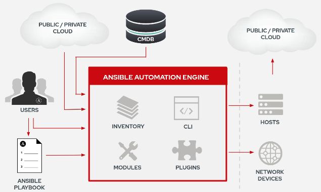

# 101 - Ansible Crash-Course Workshop

## Introduction
The 101 is a run through Ansible components providing the necessary hands-on to build automation with a good set of principles and best practices.

### Principles 
Some principles to keep in mind during this workshop and as takeaways:
* automation should be considered as coding and as such the content should be hosted on version-control system like Git. 
* better have a KISS than a sorry... Keep It Stupid Simple; start with basic playbook and static inventory then fluff© it up
* write-test-fix loop (think DevOps) then refactor and modularize later

### what's Ansible?


## Let's start!
### It ain't gonna magically happen!
Let's install Ansible on your machine or access a machine with Ansible. Then try the following:
```
ansible localhost -m ping
```
The expected outcome is:
```
localhost | SUCCESS => {
    "changed": false, 
    "ping": "pong"
}
```
Then try the following:
```
ansible localhost -m setup
``` 
Let's discuss about it for 2 minutes, then forgot about it for a couple of hours and come back to it.

### It ain't gonna magically connect!
Ansible is agentless and doesn't work in a pull approach but in push with credentials.

#### Linux
When it comes to Linux, the connection towards the target is done through SSH.
This is a very basic process, unless SSH has been disabled, only a valid user with SUDO rights is necessary along with a password-less connection. 

To do so, have a bit of play with: 
```
ssh-keygen
ssh-copy-id
```

#### Win
When it comes to Windows, the connection towards the target is done through WinRM.
Since Windows Vista, WinRM is shipped standard with Windows but needs to be enabled. 
Here is two references to make it happen painless:
* The following powershell script can be used to enable it:
https://github.com/ansible/ansible/tree/devel/examples/scripts 
* A good blog post about to connect to a Windows host:
https://www.ansible.com/blog/connecting-to-a-windows-host 

### Inventories
Ansible inventories are much more than just a list of target to run automation on.
